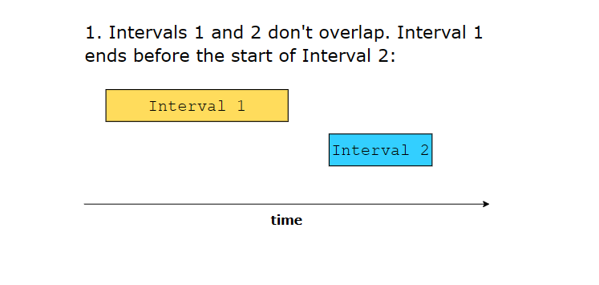
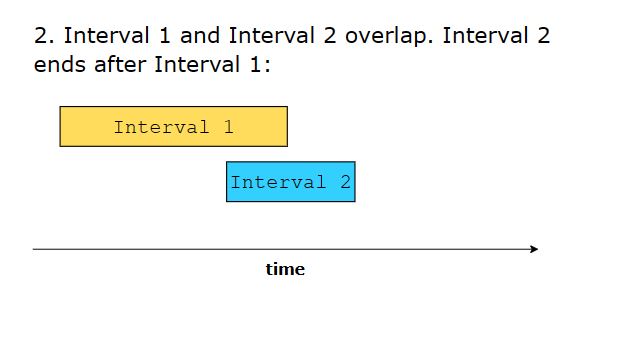
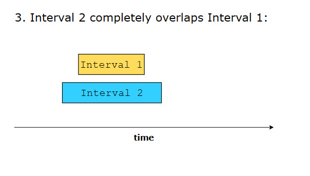
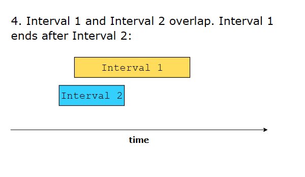

# Merge Intervals Pattern

## Overview

The merge intervals pattern is a powerful technique for solving problems involving overlapping time periods, ranges, or any data that can be represented as intervals. This pattern is frequently tested in coding interviews and has many real-world applications.

### Core Concept
Each interval is represented by a start and an end point: `[start, end]`

**6 different ways in which two intervals can relate to each other**:







### Interval Relationships
1. **No Overlap**: `a.end < b.start` or `b.end < a.start`
2. **Overlap**: `a.start <= b.end && b.start <= a.end`
3. **Complete Overlap**: One interval completely contains another
4. **Partial Overlap**: Intervals partially overlap
5. **Adjacent**: `a.end == b.start` or `b.end == a.start`
6. **Identical**: `a.start == b.start && a.end == b.end`

## When to Use This Pattern

✅ **Use when you see:**
- Array of intervals/ranges
- Problems involving overlapping periods
- Scheduling conflicts
- Time-based data processing
- Range queries and updates

✅ **Problem indicators:**
- "Merge overlapping..."
- "Find conflicts in..."
- "Schedule meetings..."
- "Remove overlapping..."
- "Insert interval..."

❌ **Don't use when:**
- Single interval operations
- Non-overlapping guaranteed data
- Problems requiring complex interval arithmetic

## Base Approach (Merge Intervals)

Statement: https://leetcode.com/problems/merge-intervals/

### Solutions

https://www.geeksforgeeks.org/merging-intervals/

0. Sort the intervals by startTime first (if needed)

1. Insert the first interval from the input list into the output list.

2. Traverse the input list of intervals. For each interval in the input list, we do the following:
   - If the input interval is overlapping with the last interval in the output list, merge these two intervals and replace the last interval of the output list with this merged interval.
   - Otherwise, add the input interval to the output list.

```typescript
function merge(intervals: number[][]): number[][] {
  if (intervals.length === 1) return intervals;
  // 0. Sort the intervals by startTime first (if needed)
  intervals.sort((a, b) => a[0] - b[0]);

  // 1. Insert the first interval from the input list into the output list.
  const result = [intervals[0]];

  // 2.Traverse the input list of intervals. For each interval in the input list, we do the following:
  for (let i = 1; i < intervals.length; i++) {
    const lastInterval = result.pop();
    // 2a. If the input interval is overlapping with the last interval in the output list
    if (lastInterval[1] >= intervals[i][0]) {
      // merge these two intervals and replace the last interval of the output list with this merged interval.
      const newInterval = [lastInterval[0], Math.max(lastInterval[1], intervals[i][1])];
      result.push(newInterval);
    } else {
      // 2b. Otherwise, add the input interval to the output list.
      result.push(lastInterval); // push back
      result.push(intervals[i]); // add to the last
    }
  }

  return result;
}
```

### Complexity

- Time: O(n)
- Space: O(1) (only use constant space other than the input and output data structures)

## Common Patterns and Variations

### 1. Insert Interval Pattern
**Problem**: Insert a new interval into a sorted list of non-overlapping intervals

```typescript
function insert(intervals: number[][], newInterval: number[]): number[][] {
    const result: number[][] = [];
    let i = 0;
    
    // Add all intervals that end before newInterval starts
    while (i < intervals.length && intervals[i][1] < newInterval[0]) {
        result.push(intervals[i]);
        i++;
    }
    
    // Merge overlapping intervals
    while (i < intervals.length && intervals[i][0] <= newInterval[1]) {
        newInterval[0] = Math.min(newInterval[0], intervals[i][0]);
        newInterval[1] = Math.max(newInterval[1], intervals[i][1]);
        i++;
    }
    result.push(newInterval);
    
    // Add remaining intervals
    while (i < intervals.length) {
        result.push(intervals[i]);
        i++;
    }
    
    return result;
}
```

### 2. Remove Overlapping Intervals
**Problem**: Remove minimum number of intervals to make the rest non-overlapping

```typescript
function eraseOverlapIntervals(intervals: number[][]): number {
    if (intervals.length <= 1) return 0;
    
    // Sort by end time (greedy approach)
    intervals.sort((a, b) => a[1] - b[1]);
    
    let count = 0;
    let lastEnd = intervals[0][1];
    
    for (let i = 1; i < intervals.length; i++) {
        if (intervals[i][0] < lastEnd) {
            // Overlapping interval, remove it
            count++;
        } else {
            lastEnd = intervals[i][1];
        }
    }
    
    return count;
}
```

### 3. Interval Intersection
**Problem**: Find intersection of two lists of intervals

```typescript
function intervalIntersection(firstList: number[][], secondList: number[][]): number[][] {
    const result: number[][] = [];
    let i = 0, j = 0;
    
    while (i < firstList.length && j < secondList.length) {
        const start = Math.max(firstList[i][0], secondList[j][0]);
        const end = Math.min(firstList[i][1], secondList[j][1]);
        
        // Check if there's an intersection
        if (start <= end) {
            result.push([start, end]);
        }
        
        // Move pointer of interval that ends first
        if (firstList[i][1] < secondList[j][1]) {
            i++;
        } else {
            j++;
        }
    }
    
    return result;
}
```

### 4. Meeting Rooms Pattern
**Problem**: Determine if a person can attend all meetings

```typescript
function canAttendMeetings(intervals: number[][]): boolean {
    intervals.sort((a, b) => a[0] - b[0]);
    
    for (let i = 1; i < intervals.length; i++) {
        if (intervals[i][0] < intervals[i - 1][1]) {
            return false; // Overlap detected
        }
    }
    
    return true;
}

function minMeetingRooms(intervals: number[][]): number {
    if (intervals.length === 0) return 0;
    
    const starts = intervals.map(i => i[0]).sort((a, b) => a - b);
    const ends = intervals.map(i => i[1]).sort((a, b) => a - b);
    
    let rooms = 0;
    let endPointer = 0;
    
    for (let i = 0; i < starts.length; i++) {
        if (starts[i] >= ends[endPointer]) {
            endPointer++;
        } else {
            rooms++;
        }
    }
    
    return rooms;
}
```

## Advanced Techniques

### 1. Sweep Line Algorithm
**Use Case**: Process events in chronological order

```typescript
interface Event {
    time: number;
    type: 'start' | 'end';
}

function maxConcurrentIntervals(intervals: number[][]): number {
    const events: Event[] = [];
    
    for (const [start, end] of intervals) {
        events.push({ time: start, type: 'start' });
        events.push({ time: end, type: 'end' });
    }
    
    // Sort events by time, with 'end' events before 'start' events at same time
    events.sort((a, b) => {
        if (a.time !== b.time) return a.time - b.time;
        return a.type === 'end' ? -1 : 1;
    });
    
    let maxConcurrent = 0;
    let current = 0;
    
    for (const event of events) {
        if (event.type === 'start') {
            current++;
            maxConcurrent = Math.max(maxConcurrent, current);
        } else {
            current--;
        }
    }
    
    return maxConcurrent;
}
```

### 2. Interval Tree (for complex queries)
```typescript
class IntervalTreeNode {
    interval: [number, number];
    max: number;
    left: IntervalTreeNode | null = null;
    right: IntervalTreeNode | null = null;
    
    constructor(interval: [number, number]) {
        this.interval = interval;
        this.max = interval[1];
    }
}

class IntervalTree {
    root: IntervalTreeNode | null = null;
    
    insert(interval: [number, number]): void {
        this.root = this.insertHelper(this.root, interval);
    }
    
    private insertHelper(node: IntervalTreeNode | null, interval: [number, number]): IntervalTreeNode {
        if (!node) return new IntervalTreeNode(interval);
        
        if (interval[0] < node.interval[0]) {
            node.left = this.insertHelper(node.left, interval);
        } else {
            node.right = this.insertHelper(node.right, interval);
        }
        
        node.max = Math.max(node.max, interval[1]);
        return node;
    }
    
    search(interval: [number, number]): [number, number] | null {
        return this.searchHelper(this.root, interval);
    }
    
    private searchHelper(node: IntervalTreeNode | null, interval: [number, number]): [number, number] | null {
        if (!node) return null;
        
        // Check if current interval overlaps
        if (this.doOverlap(node.interval, interval)) {
            return node.interval;
        }
        
        // If left subtree has overlapping interval
        if (node.left && node.left.max >= interval[0]) {
            return this.searchHelper(node.left, interval);
        }
        
        return this.searchHelper(node.right, interval);
    }
    
    private doOverlap(a: [number, number], b: [number, number]): boolean {
        return a[0] <= b[1] && b[0] <= a[1];
    }
}
```

## Problem-Solving Strategy

### Step-by-Step Approach
1. **Understand the Problem**
   - What type of intervals are we dealing with?
   - What constitutes an overlap?
   - What's the expected output?

2. **Choose the Right Approach**
   - Simple merge: Sort by start time
   - Optimization problems: Sort by end time (greedy)
   - Query problems: Consider interval tree or sweep line

3. **Handle Edge Cases**
   - Empty input
   - Single interval
   - No overlaps
   - Complete overlaps
   - Adjacent intervals

4. **Optimize**
   - Can we avoid sorting?
   - Can we use two pointers?
   - Is there a greedy solution?

## Interview Tips

### Common Mistakes
1. **Incorrect Overlap Detection**: Remember `a.start <= b.end && b.start <= a.end`
2. **Wrong Sorting Strategy**: Choose based on problem requirements
3. **Edge Case Handling**: Empty arrays, single intervals
4. **Off-by-One Errors**: Be careful with inclusive/exclusive endpoints

### Optimization Techniques
1. **Greedy Approach**: For optimization problems, sort by end time
2. **Two Pointers**: For intersection problems
3. **Sweep Line**: For complex event processing
4. **Early Termination**: Stop when no more overlaps possible

### Time Complexity Analysis
- **Sorting**: O(n log n)
- **Merging**: O(n)
- **Overall**: Usually O(n log n) due to sorting
- **Space**: O(1) to O(n) depending on output requirements

## Practice Problems

### Easy
- [Merge Intervals](https://leetcode.com/problems/merge-intervals/)
- [Meeting Rooms](https://leetcode.com/problems/meeting-rooms/)

### Medium
- [Insert Interval](https://leetcode.com/problems/insert-interval/)
- [Non-overlapping Intervals](https://leetcode.com/problems/non-overlapping-intervals/)
- [Interval List Intersections](https://leetcode.com/problems/interval-list-intersections/)
- [Meeting Rooms II](https://leetcode.com/problems/meeting-rooms-ii/)

### Hard
- [Employee Free Time](../src/employee-free-time/statement.md)
- [Data Stream as Disjoint Intervals](https://leetcode.com/problems/data-stream-as-disjoint-intervals/)
- [Range Module](https://leetcode.com/problems/range-module/)

## Real-World Applications

1. **Calendar Systems**: Meeting scheduling, conflict detection
2. **Resource Management**: Room booking, equipment allocation
3. **Network Traffic**: Bandwidth allocation, QoS management
4. **Database Systems**: Range queries, index optimization
5. **Computational Geometry**: Line segment intersection
6. **Bioinformatics**: Gene sequence analysis, protein folding

## Related Patterns
- **Sweep Line Algorithm**: For event-based processing
- **Two Pointers**: For intersection problems
- **Greedy Algorithms**: For optimization problems
- **Binary Search**: For interval queries in sorted data
