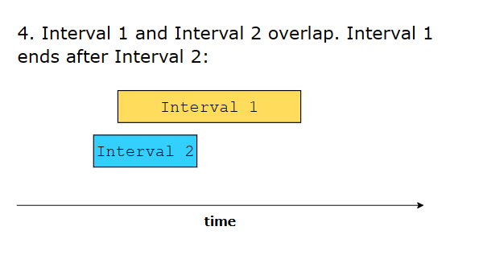
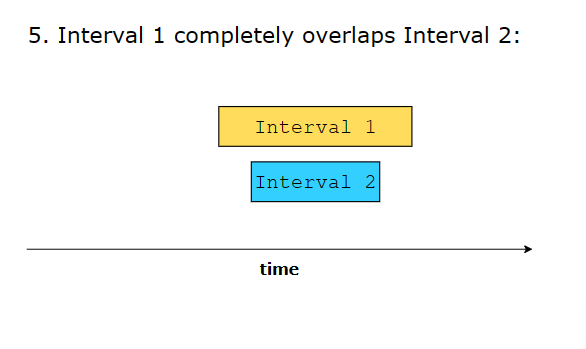
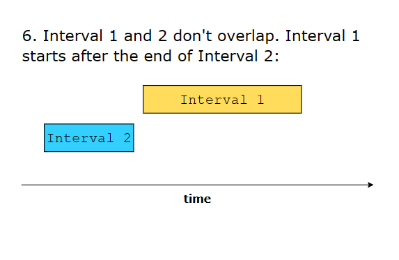

# MERGE INTERVALS

## Overview
The merge intervals pattern deals with problems involving overlapping intervals. Each interval is represented by a start and an end time.

**6 different ways in which two intervals can relate to each other**: 

## When should we use
- The input data is an array of intervals.
- The problem requires dealing with overlapping interval.
- The input list of intervals is sorted or is able to be sorted.

## Base Approach (Merge Intervals)
Statement: https://leetcode.com/problems/merge-intervals/
### Solutions
https://www.geeksforgeeks.org/merging-intervals/

0. Sort the intervals by startTime first (if needed)

1. Insert the first interval from the input list into the output list.

2. Traverse the input list of intervals. For each interval in the input list, we do the following:
    - If the input interval is overlapping with the last interval in the output list, merge these two intervals and replace the last interval of the output list with this merged interval.
    - Otherwise, add the input interval to the output list.

### Complexity
- Time: O(n)
- Space: O(1) (only use constant space other than the input and output data structures)

## Examples
### Insert Intervals: 
https://leetcode.com/problems/insert-interval/
### Non-overlapping Intervals:
https://leetcode.com/problems/non-overlapping-intervals/
### Interval List Intersections:
https://leetcode.com/problems/interval-list-intersections/
### Employee Free Time
[Statement](../src/employee-free-time/statement.md)